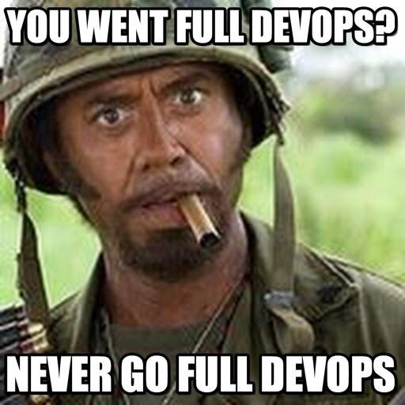
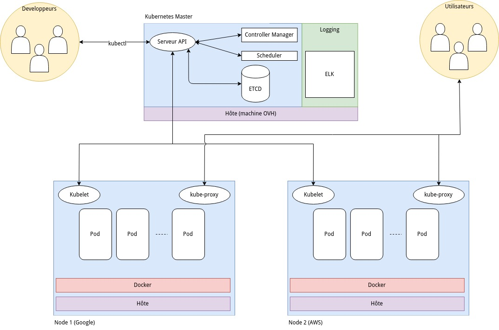
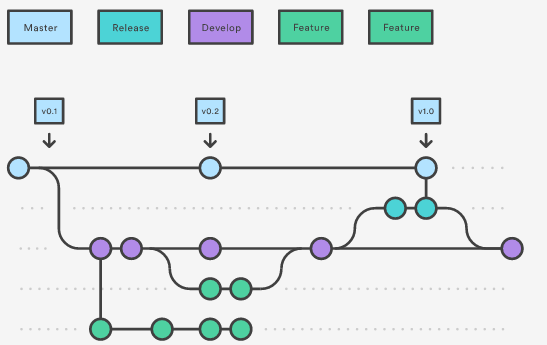

# Petit POC DevOps

Le pinotage est un cépage Sud Africain très connu au Cap. Bien qu'il soit aussi ici question de grappe, nous en parlerons plutôt en terme de resources informatiques puisqu'un des sujets de ce projet est la création d'une "grappe de serveurs" en bon français. Plus communément appelé cluster, nous l'utiliserons comme plateforme de nos applications conteneurisées. 

Mais au delà du support et des considérations techniques, c'est véritablement une méthodologie orientée vers la culture DevOps que nous allons tenter d'entretenir tout au long de notre projet.

Dans cet esprit, c'est notre présentation de fin de projet qui va faire office de l'application principale a déployer. C'est une application nodejs dont le  déployement sur notre cluster fait maison va être entièrement automatisée selon la méthodologie DevOps. 

Sans compter la phase de préparation, ce projet est conçu pour être livré en une semaine par une équipe de trois adeptes DevOps en herbe. 

## Sexy \#DevOps

La méthodologie DevOps est très en vogue en ce moment. Tout le monde s'arrache "les DevOps" et bien des acteurs s'approprient ce terme. On parle de méthodologie, de philosophie, de culture, voir même de culte tout court dans certains [cercles](https://devops.com/devops-like-fitness-religion/)... De même qu'on ne peut pas se revendiquer "geek" parce qu'on aime regarder The Big Bang Theory, on n'est pas DevOps parce qu'on utilise Maven pour empaqueter une application Java. Et on n'est certainement pas "full DevOps" parce qu'on utilise Docker...

En revanche, il est vrai qu'une bonne maîtrise des outils favorise à entretenir le mythe. Quand un DevOps claque des doigts, des instances se créent dans le cloud, des cluster se forment, des applications se déploient et des mises à l'échelle s'implémentent toutes seules. 

<p align="center">

</p>

Mais voilà : loin d'être des miracles, ces tâches ne peuvent réussir que si elles sont préparées avec soin selon une méthodologie standardisée très rigoureuse qui n'accepte que peu de compromis. C'est l'esprit DevOps, l'automatisation poussée à son paroxysme qui en théorie permettrait de developper une application sans coder une seule ligne. 

C'est d'ailleur ce que nous allons tenter dans ce projet. Notre objectif est de produire une application et son infrastructure qui la supporte sans générer une seule ligne de code dans le language natif de l'application. Dans ce cas précis, nous allons tenter de développer une application NodeJS sans écrire une seule ligne de Javascript.

*Accrochez vos ceintures, on passe en mode full DevOps*
<p align="center">
  
</p>

## Phase de préparation

Pour accueillir notre application, nous avons besoin d'une plateforme. Et nous avons le choix ! Entre les IaaS, les PaaS, les CaaS, les SaaS et j'en passe, l'offre de services n'a jamais été aussi fournie. Pour faire notre choix, gardons à l'esprit que notre objectif est d'explorer les techniques d'automatisation en gardant une approche la plus agnostique possible et un contrôle complet des différentes couches logicielles (on parlera de stack par la suite). 

Pour ce projet, l'utilisation de conteneurs permet un déployment rapide et un gain de temps non négligeable sur toute la partie de mise en place et de configuration des applications. Par exemple, s'il nous faut un serveur Share Latex pour éditer notre rapport de projet, il suffira d'appeler un conteneur qui contiendra une image de Share Latex prête à l'emploi. 

Tout naturellement, pour gérer nos conteneurs nous utiliserons Docker. En plus d'offrir une solution stable, elle est largement supportée et documentée par une énorme communauté.

Au delà de la création de conteneurs, et puisque nous voulons automatiser au maximum les processus, pourquoi ne pas utiliser une solution qui va gérer nos conteneurs, les répartir sur nos machines selon leur ressources, surveiller leur santé et veiller à ce qu'ils soient toujours en fonction. 

> Parce qu'il ne faut pas oublier qu'une des qualités premières du DevOps est qu'il est très fainéant... 

Depuis peu, un acteur se détache de la guerre des orchestrateurs de conteneurs entre Kubernetes, Docker Swarm, OpenShift et d'autres. Kubernetes est supporté par une enorme communauté, offre une API solide et une grande flexibilité. L'envers de la médaille c'est qu'il faut un peu d'huile de coude pour tout mettre en place. 

Nous pourrions utiliser une solution tout-en-un (GKE ou AWS) mais le but de ce projet est d'apprendre. Alors apprenons !

### Postulat de départ

Nous avons à notre disposition 3 machines connectées à un réseau local. Nous pouvons :

- rester dans une optique classique et créer des machines virtuelles à la main puis installer les paquets nécessaires à Kubernetes

- honorer nos engagements d'automatisation dans l'esprit DevOps et utiliser des outils de création et d'approvisionnement des instances de support à Kubernetes.

Etant donné le nombre de nodes impliqués dans notre projet, les deux approches sont valables et réalisables dans des temps d'implémentation similaires. Nous avons choisi la deuxième méthode qui, en plus de son intérêt pédagogique évident, nous permet une mise à l'échelle rapide et facilité.

### Quelques notions d'architecture

Avant de se lancer tête baissée dans la création de notre cluster, il est nécessaire de bien en comprendre le fonctionnement. Cela nous aidera pour mettre en place les bonnes pratiques liées au déployement de nos applications. Nous allons nous baser sur une architecture standard de Kubernetes :



- Serveur API : toutes les méthodes exposées par Kubernetes. l'API permet d'intéragir avec le cluster au moyen de JSON et de requêtes HTTP. Les requêtes mettent à jour l'état des objets stockés dans etcd. 

- Controller Manager : structure de contrôle qui régit l'état du cluster. Les requêtes API permettent d'indiquer au controlleur l'état désiré et le controlleur se charge d'y amener le cluster. 

- Scheduler : ou ordonnanceur en français permet de planifier les activités du cluster en fonction de la charge de travail, des performances et de la capacité du cluster. Il est assisté par les kubelets qui lui renseignent les performances du node sur lequel ils sont installés. 

- Etcd : la base de données qui stocke et gère les données de configuration du cluster. 

- kubectl : Kubernetes Command Line Tool. Permet d'utiliser l'API Kubernetes grâce à des commandes utilisables directement par les developpeurs.

- kubelet : gère l'état d'un noeud et prend en charge la gestion des conteneurs organisés dans les pods .

- Pod : un groupe d'un ou plusieurs conteneurs qui partagent des ressources de stockage et de réseau en commun. Les conteneurs au sein d'un même pod peuvent communiquer via localhost.

- Conteneur : contient une ou plusieurs applications avec tous les outils nécessaires pour les lancer. 

- kube-proxy : il fait office de proxy réseau et de répartiteur de charge. Il expose les ports nécessaire à la communication extérieure au cluster et route le traffic vers le conteneur approprié 

- Logging/ELK : la pile ElasticSearch, Logstash et Kibana qui va nous permettre d'avoir une solution d'analyse de log. 


### Le Workflow
> Git flow ou GitHub flow ? telle est la question...

Afin de limiter le chaos qu'engendre le développement collaboratif, il est crucial de décider d'un bon "flux de travail" ou workflow qui va définir la manière de gérer le tous les aspects de développement du projet.
Il existe plusieurs approches basées sur l'outil Git, le plus populaire étant Git flow.

Adapté pour la méthodologie agile, Git flow permet de gérer l'ajout de multiples fonctionnalités de manière indépendante sans intéragir directement avec la branche master. 

<p align="center">
  
</p>

*Un exemple de git flow*

Le git flow préconise l'utilisation d'une branche **master** et d'une branche **develop**. La branche master est la branche de production, elle porte les tags de version et les commit n'y sont pas fréquents. La branche develop est la branche des développeurs, elle sert de branche de base pour les features et les releases. S'ajoutent à ces branches de base des branches éphémères aux buts bien définis :
- **feature** pour ajouter une fonctionnalité
- **release** pour faire tampon entre la branche **develop** et la branche **master**
- **hotfix** pour gérer les bugs en urgence directement depuis le **master**

Si ces méthodes sont idéales pour une mise en production controlée et organisée, elles s'apparentent dans notre cas à l'utilisation d'un bazooka pour tuer une mouche. D'autant plus que cette gestion n'est pas idéale dans le cas de commit fréquents sur le master.

Nous allons donc utiliser une version beaucoup plus légère appelée **Github flow**. En plus d'être plus intuitive et d'offrir une courbe d'apprentissage bien plus confortable, elle permet de gérer les processus de développement directement dans le navigateur, grâce à la puissance de Github.

<p align="center">
  
</p>

Les étapes de Github flow s'articulent de cette manière :

- Création d'une branche depuis le repo
- Créer, éditer, supprimer des fichiers
- Envoyer une pull request  depuis la branche pour lancer une discussion entre dev
- Continuer les modification en mettant à jour la pull request
- Quand toutes les modifications sont prêtes, on les merge directement sur le master
- On supprime la branche
- Rinse and repeat

> Ou alors quand on est admin, on commit directement sur la branche master comme un cochon en faisant fi des toutes les règles (bon.. si c'est pour update le Readme on va pas m'en vouloir... Si ?)

Cette méthode va nous permettre des itérations rapides et des déploiement fréquents, ce qui sera vital étant donné le temps restreint alloué au projet.

Maintenant que les objectifs et l'organisation du travail sont définis nous allons pouvoir nous attaquer à la construction du cluster Kubernetes.

### Creation des machines virtuelles

Pour pouvoir créer des environnements de travail similaires à toute l'équipe, nous allons utiliser une image Ubuntu customisée avec Packer. 

Packer permet de créer et répliquer des machines virtuelles à l'aide de fichiers de configuration JSON. Pour créer les machines virtuelles, il suffit de lancer la commande :

```sh 
packer packer.json
```

Le fichier [packer.json](./packer/packer.json) permet de provisionner une VM avec le script [setup.sh](./packer/scripts/setup.sh) qui installe ```kubeadm``` et toutes ses dépendances

### Stockage de la box sur Vagrant Cloud

Notre box générée par Packer a été uploadée sur le Vagrant Cloud à l'adresse suivante : [https://app.vagrantup.com/dev2ops/boxes/kube](https://app.vagrantup.com/dev2ops/boxes/kube). De ce fait il est possible de la télécharger depuis n'importe où grâce aux fichiers Vagrantfile fournie dans le projet. Il suffit de copier le fichier dans le répertoire courant et de lancer :

```sh
vagrant up
```

Si la box n'a pas encore téléchargée, vagrant va la chercher sur Vagrant Cloud pour la stocker localement afin de l'utiliser plus rapidement la prochaine fois.

Nous avons donc 3 instances réutilisables à volonté si jamais le cluster ne fonctionne plus : 1 master et 2 nodes.

### Création du cluster Kubernetes 

Sur le master, on lance un 
```sh
sudo kubeadm init
```
Si le process s'interrompt, il est possible que la swap soit encore active sur le système. On peut la désactiver par la commande :

```sh
sudo swapoff -a
```

> Il faut le faire aussi sur les nodes si besoin. 

A la fin de l'initialisation, executer les commandes indiquées et copier la commande ```kubeadm join``` pour joindre les noeuds au cluster. 

Sur les nodes, lancer la commande ```kubeadm join``` avec le token fourni à la création du cluster. Si il y a besoin de regénérer des token parce que celui d'origine a expiré, on peut en creer d'autre avec la commande : 

```sh
sudo kubeadm token create --print-join-command
```
